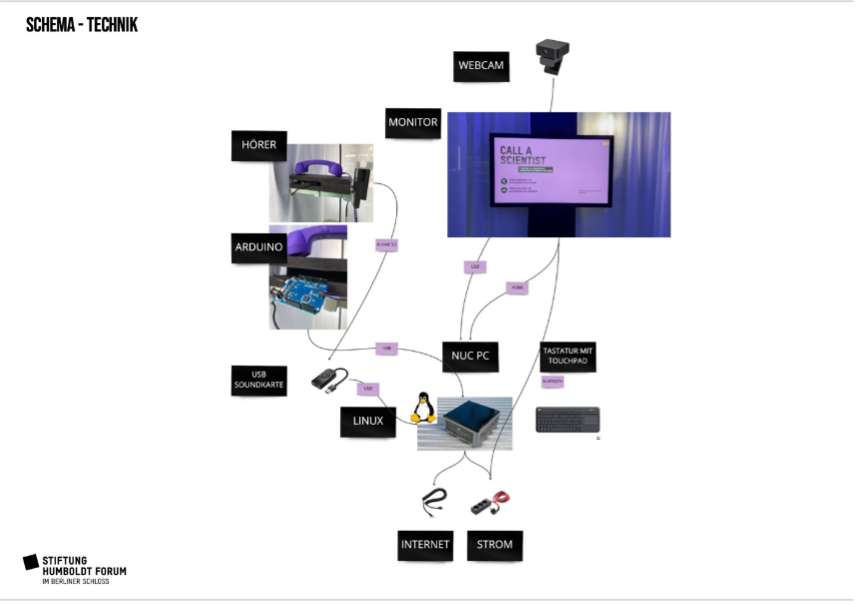

# Hybride 1:1 Station. Use-Case „Call a Scientist“ im Museum

## Inhaltsverzeichnis
* [Kurzbeschreibung](#Kurzbeschreibung) 
* [Förderhinweis](#Förderhinweis)
* [Installation](#Installation)
* [Benutzung](#Benutzung)
* [Credits](#Credits)
* [Lizenz](#Lizenz)
 
 
# Kurzbeschreibung
Die Hybridstation bricht mit zwei gelernten Medienpraktiken: 
Der Monitor im Museum streamt plötzlich live (statt nur Inhalte abzuspielen) und der Telefonhörer wird Teil einer Videokonferenz (statt nur eine Tonspur abzuspielen). Der Telefonhörer in die Videokonferenz. Verbunden mit einem Mikrocomputer und einem Schalter, löst das Abnehmen des violetten Telefonhörers einen Impuls aus. Die Slideshow auf dem Monitor wechselt zu einem Countdown: 3, 2, 1 … der Video Call startet. Was passiert genau?  Ein Skript kontrolliert, ob der Monitor eine Slideshow anzeigt oder zum Browser wechselt, in dem die Videokonferenz gestartet wurde. Wie weiß das Skript, was angezeigt werden soll? Ein kleiner Schalter an der Hörer-Halterung ist mit einem Arduino verbunden, der den Impuls an das Skript weitergibt (Hörer an/aus).

Technik-Schema © Stiftung Humboldt Forum 
 
# Förderhinweis
Dieses Produkt ist entstanden im Verbundprojekt museum4punkt0 – Digitale Strategien für das Museum der Zukunft, im Teilprojekt der Stiftung Humboldt Forum „RealDigital – Hybride Kulturveranstaltungen“. 
Das Projekt museum4punkt0 wird gefördert durch die Beauftragte der Bundesregierung für Kultur und Medien aufgrund eines Beschlusses des Deutschen Bundestages. 

Weitere Informationen: www.museum4punkt0.de

# Installation

1. Linux Ubuntu installieren und einrichten.
 System updaten & pygame (Python) einrichten - Im Terminal folgende Befehle ausführen
 - `sudo apt-get update`
 - `sudo apt-get upgrade`
 - `sudo apt-get install python3`
 - `sudo apt-get install python3-pip`
 - `sudo apt-get insatll nano`
 - `pip install pygame`
2. Desktop Icon erstellen - Im Terminal folgende Befehle ausführen
 - `sudo nano programm.py`
  - (Textinhalt von Programm.py einfügen )
  - STRG + O
  - ENTER
  - STRG + X
3. Desktop Icon erstellen - Im Terminal folgende Befehle ausführen
 - sudo nano py.desktop
  - (Textinhalt von py.desktop einfügen)
  - STRG + O
  - ENTER
  - STRG + X
 - `chmod u+x /home/<user>/<directory>/Programm.py`
 - icon mit rechter Maustaste öffnen:  Allow Launching
4. Arduino (32u4) als USB Tastatur einrichten
 - Arduino IDE herunterladen [https://www.arduino.cc/en/software](https://www.arduino.cc/en/software)
 - im Terminal
  - `cd Downloads`
  - `sudo sh install.sh`
  - `ls -l /dev/ttyACM*`
  - `sudo usermod -a -G dialout <username>`
 - keyboard.h library installation
 - Tastatur.ino einfüge und uploaden auf dem arduino, Quelle: [https://docs.arduino.cc/tutorials/micro/keyboard-press](https://docs.arduino.cc/tutorials/micro/keyboard-press)
5. Computer einrichten mit Video-Konferenz Programm
 - Videokonferenz im Browser starten 
 - alle Teilnehmer*innen einladen 
 - gewünschte Darstellung im Vollbildmodus auswählen
 - zum Desktop zurückkehren (Shortcut: WIN+D )
 Tipp:
 - Bilder im Bildfolge-Programm können ersetzt werden, um beispielsweise neue Gesprächspartner / Themen zu präsentieren.
6. Benutzung und Start Veranstaltung
Verbunden mit einem Mikrocomputer und einem Schalter, löst das Abnehmen des violetten Telefonhörers einen Impuls aus. Die Slideshow auf dem Monitor wechselt zu einem Countdown: 3, 2, 1 … der Video Call startet. Was passiert genau?  Ein Skript kontrolliert, ob der Monitor eine Slideshow anzeigt oder zum Browser wechselt, in dem die Videokonferenz gestartet wurde. Wie weiß das Skript, was angezeigt werden soll? Ein kleiner Schalter an der Hörer-Halterung ist mit einem Arduino verbunden, der den Impuls an das Skript weitergibt (Hörer an/aus).  

# Benutzung

## KEYBOARD USB
- [./code/Keybord_USB.ino](./code/Keybord_USB.ino)

## Phyton 
- [./code/bilder.py](./code/bilder.py)
- [./code/py.desktop](./code/py.desktop)

# Credits
- Stiftung Humboldt Forum im Berliner Schloss (Teilprojekt Hybride Kulturveranstaltungen: Essling, Christine; Frey, Lavinia; Maehler, Norman)
- Kobold Berlin mit Studio Biere im Auftrag von Stiftung Humboldt Forum im Berliner Schloss

# Lizenz
- [Lizenz](./LICENSE)
