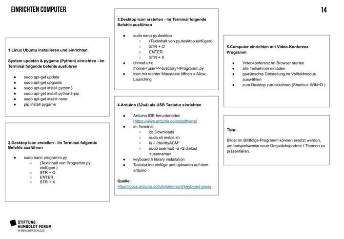

# Hybride 1:1 Station. Use-Case „Call a Scientist“ im Museum

## Inhaltsverzeichnis
* [Kurzbeschreibung](#Kurzbeschreibung) 
* [Förderhinweis](#Förderhinweis)
* [Installation](#Installation)
* [Benutzung](#Benutzung)
* [Credits](#Credits)
* [Lizenz](#Lizenz)
 
 
# Kurzbeschreibung
Die Hybridstation bricht mit zwei gelernten Medienpraktiken: 
Der Monitor im Museum streamt plötzlich live (statt nur Inhalte abzuspielen) und der Telefonhörer wird Teil einer Videokonferenz (statt nur eine Tonspur abzuspielen). Der Telefonhörer in die Videokonferenz. Verbunden mit einem Mikrocomputer und einem Schalter, löst das Abnehmen des violetten Telefonhörers einen Impuls aus. Die Slideshow auf dem Monitor wechselt zu einem Countdown: 3, 2, 1 … der Video Call startet. Was passiert genau?  Ein Skript kontrolliert, ob der Monitor eine Slideshow anzeigt oder zum Browser wechselt, in dem die Videokonferenz gestartet wurde. Wie weiß das Skript, was angezeigt werden soll? Ein kleiner Schalter an der Hörer-Halterung ist mit einem Arduino verbunden, der den Impuls an das Skript weitergibt (Hörer an/aus).

Technik-Schema © Stiftung Humboldt Forum 
 
# Förderhinweis
Dieses Produkt ist entstanden im Verbundprojekt museum4punkt0 – Digitale Strategien für das Museum der Zukunft, im Teilprojekt der Stiftung Humboldt Forum „RealDigital – Hybride Kulturveranstaltungen“. 
Das Projekt museum4punkt0 wird gefördert durch die Beauftragte der Bundesregierung für Kultur und Medien aufgrund eines Beschlusses des Deutschen Bundestages. 

Weitere Informationen: www.museum4punkt0.de

 

# Installation
[Einrichten Computer](./img/Einrichten_Computer_Bildwechsel.pdf)
<object data="./img/Einrichten_Computer_Bildwechsel.pdf" type="application/pdf" width="100%"> 
</object>

# Benutzung

## KEYBOARD USB
- [./code/Keybord_USB.ino](./code/Keybord_USB.ino)

## Phyton 
- [./code/bilder.py](./code/bilder.py)
- [./code/py.desktop](./code/py.desktop)

# Credits
- Stiftung Humboldt Forum im Berliner Schloss (Teilprojekt Hybride Kulturveranstaltungen: Essling, Christine; Frey, Lavinia; Maehler, Norman)
- Kobold Berlin mit Studio Biere im Auftrag von Stiftung Humboldt Forum im Berliner Schloss

# Lizenz
- [Lizenz](./LICENSE)
